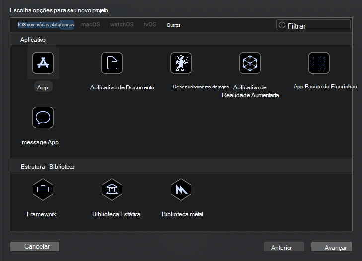
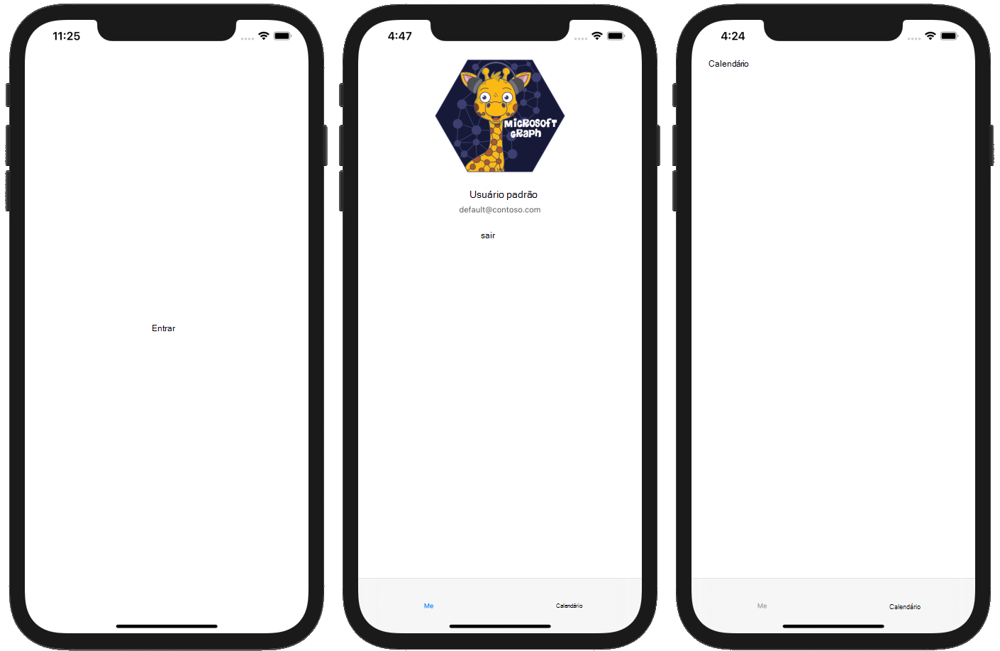

<!-- markdownlint-disable MD002 MD041 -->

Comece criando um novo projeto Swift.

1. Abra o Xcode. No menu **arquivo** , selecione **novo**e, em seguida, **projeto**.
1. Escolha o modelo de **aplicativo exibir único** e selecione **Avançar**.

    

1. Defina o **nome** do produto `GraphTutorial` como e o **idioma** como **Swift**.
1. Preencha os campos restantes e selecione **Avançar**.
1. Escolha um local para o projeto e selecione **criar**.

## <a name="install-dependencies"></a>Instalar dependências

Antes de prosseguir, instale algumas dependências adicionais que serão usadas posteriormente.

- [Biblioteca de autenticação da Microsoft (MSAL) para IOS](https://github.com/AzureAD/microsoft-authentication-library-for-objc) para autenticação com o Azure AD.
- [MSAL provedor de autenticação para o objetivo C](https://github.com/microsoftgraph/msgraph-sdk-objc-auth) para conectar o MSAL ao SDK do Microsoft Graph.
- [SDK do Microsoft Graph para o objetivo C](https://github.com/microsoftgraph/msgraph-sdk-objc) para fazer chamadas para o Microsoft Graph.
- [SDK de modelos do Microsoft Graph para o objetivo C](https://github.com/microsoftgraph/msgraph-sdk-objc-models) para objetos fortemente tipados que representam os recursos do Microsoft Graph, como usuários ou eventos.

1. Encerre o Xcode.
1. Abra o terminal e altere o diretório para o local do seu projeto do **GraphTutorial** .
1. Execute o comando a seguir para criar um Podfile.

    ```Shell
    pod init
    ```

1. Abra o Podfile e adicione as seguintes linhas logo após a `use_frameworks!` linha.

    ```Ruby
    pod 'MSAL', '~> 0.3.0'
    pod 'MSGraphMSALAuthProvider', '~> 0.1.1'
    pod 'MSGraphClientSDK', ' ~> 0.1.3'
    pod 'MSGraphClientModels', '~> 0.1.1'
    ```

1. Salve o Podfile e execute o seguinte comando para instalar as dependências.

    ```Shell
    pod install
    ```

1. Quando o comando for concluído, abra o **GraphTutorial. xcworkspace** recém-criado no Xcode.

## <a name="design-the-app"></a>Projetar o aplicativo

Nesta seção, você criará os modos de exibição do aplicativo: uma página de entrada, um navegador de barra de guias, uma página de boas-vindas e uma página de calendário. Você também criará uma sobreposição de indicador de atividade.

### <a name="create-sign-in-page"></a>Criar página de entrada

1. Expanda a pasta **GraphTutorial** no Xcode e selecione **ViewController. Swift**.
1. No **Inspetor de arquivos**, altere o **nome** do arquivo para `SignInViewController.swift`.

    

1. Abra **SignInViewController. Swift** e substitua seu conteúdo pelo código a seguir.

    ```Swift
    import UIKit

    class SignInViewController: UIViewController {

        override func viewDidLoad() {
            super.viewDidLoad()
            // Do any additional setup after loading the view.
        }

        @IBAction func signIn() {
            self.performSegue(withIdentifier: "userSignedIn", sender: nil)
        }
    }
    ```

1. Abra o arquivo **Main. Storyboard** .
1. Expanda **Exibir controle cena**e selecione **Exibir controlador**.

    

1. Selecione o **Inspetor de identidade**e, em seguida, altere o menu suspenso de **classe** para **SignInViewController**.

    

1. Selecione a **biblioteca**e arraste um **botão** para o **controlador de exibição de entrada**.

    

1. Com o botão selecionado, selecione o **Inspetor de atributos** e altere o **título** do botão para `Sign In`.

    

1. Selecione o **controlador de exibição de entrada**e, em seguida, selecione o **Inspetor de conexões**.
1. Em **ações recebidas**, arraste o círculo não preenchido ao lado de **entrar** no botão. Selecione **retoque** no menu pop-up.

    

1. No menu **Editor** , selecione **resolver problemas de layout automático**e, em seguida, selecione **Adicionar restrições ausentes** abaixo **de todas as exibições na controladora de exibição de entrada**.

### <a name="create-tab-bar"></a>Criar barra de guias

1. Selecione a **biblioteca**e, em seguida, arraste um **controlador da barra de guias** para o storyboard.
1. Selecione o **controlador de exibição de entrada**e, em seguida, selecione o **Inspetor de conexões**.
1. Em **segues disparado**, arraste o círculo não preenchido ao lado de **manual** no **controlador da barra de guias** no storyboard. Selecione **Mostrar modalmente** no menu pop-up.

    

1. Selecione o segue que você acabou de adicionar e, em seguida, selecione o **Inspetor de atributos**. Defina o campo **identificador** como `userSignedIn`.

    

1. Selecione o **Item 1 cena**e, em seguida, selecione o **Inspetor de conexões**.
1. Em **segues disparado**, arraste o círculo não preenchido ao lado de **manual** no **controlador de exibição de entrada** no storyboard. Selecione **Mostrar modalmente** no menu pop-up.
1. Selecione o segue que você acabou de adicionar e, em seguida, selecione o **Inspetor de atributos**. Defina o campo **identificador** como `userSignedOut`.

### <a name="create-welcome-page"></a>Criar página de boas-vindas

1. Selecione o arquivo **assets. xcassets** .
1. No menu **Editor** , selecione **Adicionar ativos**e, em seguida, **novo conjunto de imagens**.
1. Selecione o novo ativo de **imagem** e use o **Inspetor de atributos** para definir seu `DefaultUserPhoto` **nome** como.
1. Adicione qualquer imagem que você deseja que sirva como uma foto de perfil de usuário padrão.

    

1. Crie um novo arquivo de **classe Touch** do Cocoa **** na pasta GraphTutorial `WelcomeViewController`chamada. Escolha **UIViewController** na **subclasse de** Field.
1. Abra **WelcomeViewController. Swift** e substitua seu conteúdo pelo código a seguir.

    ```Swift
    import UIKit

    class WelcomeViewController: UIViewController {

        @IBOutlet var userProfilePhoto: UIImageView!
        @IBOutlet var userDisplayName: UILabel!
        @IBOutlet var userEmail: UILabel!

        override func viewDidLoad() {
            super.viewDidLoad()

            // Do any additional setup after loading the view.

            // TEMPORARY
            self.userProfilePhoto.image = UIImage(imageLiteralResourceName: "DefaultUserPhoto")
            self.userDisplayName.text = "Default User"
            self.userEmail.text = "default@contoso.com"
        }

        @IBAction func signOut() {
            self.performSegue(withIdentifier: "userSignedOut", sender: nil)
        }
    }
    ```

1. Abra **Main. Storyboard**. Selecione a **cena item 1**e, em seguida, selecione o **Inspetor de identidade**. Altere o valor da **classe** para **WelcomeViewController**.
1. Usando a **biblioteca**, adicione os itens a seguir à **cena do item 1**.

    - Um **modo de exibição de imagem**
    - Dois **Rótulos**
    - Um **botão**

1. Selecione o modo de exibição imagem e, em seguida, selecione o **Inspetor de tamanho**.
1. Defina a **largura** e a **altura** como 196.
1. Selecione o segundo rótulo e, em seguida, selecione o **Inspetor de atributos**.
1. Altere a **cor** para **cor cinza escuro**e altere a **fonte** para **System 12,0**.
1. Selecione o botão e, em seguida, selecione o **Inspetor de atributos**.
1. Altere o **título** para `Sign Out`.
1. Usando o **Inspetor de conexões**, faça as seguintes conexões.

    - Vincule a saída **UserDisplayName** ao primeiro rótulo.
    - Vincule a saída **UserEmail** ao segundo rótulo.
    - Vincule a tomada **userProfilePhoto** à visualização de imagem.
    - Vincule a ação de **SignOut** recebida à **retoque**do botão dentro.

1. Selecione o item da barra de guias na parte inferior da cena e, em seguida, selecione o **Inspetor de atributos**. Altere o **título** para `Me`.
1. No menu **Editor** , selecione **resolver problemas de layout automático**e, em seguida, selecione **Adicionar restrições ausentes** abaixo **de todos os modos de exibição no controlador de exibição de boas-vindas**

A cena de boas-vindas deve ser semelhante a esta quando você terminar.


### <a name="create-calendar-page"></a>Criar página de calendário

1. Crie um novo arquivo de **classe Touch** do Cocoa **** na pasta GraphTutorial `CalendarViewController`chamada. Escolha **UIViewController** na **subclasse de** Field.
1. Abra **CalendarViewController. Swift** e substitua seu conteúdo pelo código a seguir.

    ```Swift
    import UIKit

    class CalendarViewController: UIViewController {

        @IBOutlet var calendarJSON: UITextView!

        override func viewDidLoad() {
            super.viewDidLoad()

            // Do any additional setup after loading the view.

            // TEMPORARY
            calendarJSON.text = "Calendar"
            calendarJSON.sizeToFit()
        }
    }
    ```

1. Abra **Main. Storyboard**. Selecione a **cena item 2**e, em seguida, selecione o **Inspetor de identidade**. Altere o valor da **classe** para **CalendarViewController**.
1. Usando a **biblioteca**, adicione um **modo de exibição de texto** à **cena do item 2**.
1. Selecione o modo de exibição de texto que você acabou de adicionar. No **Editor**, escolha **incorporar no**e modo de **rolagem**.
1. Usando o **Inspetor de conexões**, conecte a tomada **calendarJSON** à visualização de texto.
1. 1. Selecione o item da barra de guias na parte inferior da cena e, em seguida, selecione o **Inspetor de atributos**. Altere o **título** para `Calendar`.
1. No menu **Editor** , selecione **resolver problemas de layout automático**e, em seguida, selecione **Adicionar restrições ausentes** abaixo **de todos os modos de exibição no controlador de exibição de boas-vindas**

A cena do calendário deve ser semelhante a esta quando você terminar.


### <a name="create-activity-indicator"></a>Criar indicador de atividade

1. Crie um novo arquivo de **classe Touch** do Cocoa **** na pasta GraphTutorial `SpinnerViewController`chamada. Escolha **UIViewController** na **subclasse de** Field.
1. Abra **SpinnerViewController. Swift** e substitua seu conteúdo pelo código a seguir.

    ```Swift
    import UIKit

    class SpinnerViewController: UIViewController {

        var spinner = UIActivityIndicatorView(style: .whiteLarge)

        override func loadView() {
            view = UIView()
            view.backgroundColor = UIColor(white: 0, alpha: 0.7)

            spinner.translatesAutoresizingMaskIntoConstraints = false
            spinner.startAnimating()
            view.addSubview(spinner)

            spinner.centerXAnchor.constraint(equalTo: view.centerXAnchor).isActive = true
            spinner.centerYAnchor.constraint(equalTo: view.centerYAnchor).isActive = true
        }

        public func start(container: UIViewController) {
            container.addChild(self)
            self.view.frame = container.view.frame
            container.view.addSubview(self.view)
            self.didMove(toParent: container)
        }

        public func stop() {
            self.willMove(toParent: nil)
            self.view.removeFromSuperview()
            self.removeFromParent()
        }
    }
    ```

## <a name="test-the-app"></a>O aplicativo de teste

Salve suas alterações e inicie o aplicativo. Você deve ser capaz de se mover entre as telas usando **** os botões entrar **e sair e** a barra de guias.


