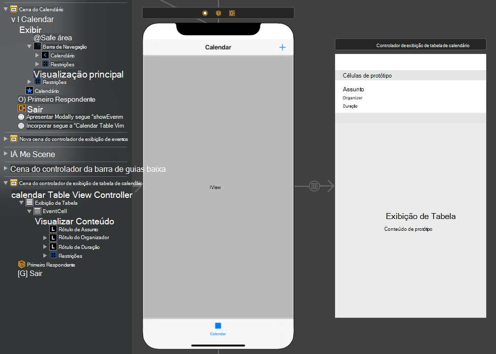

<!-- markdownlint-disable MD002 MD041 -->

Neste exercício, você incorporará o Microsoft Graph ao aplicativo. Para este aplicativo, você usará o [SDK](https://github.com/microsoftgraph/msgraph-sdk-objc) do Microsoft Graph para o Objetivo C para fazer chamadas ao Microsoft Graph.

## <a name="get-calendar-events-from-outlook"></a>Obter eventos de calendário do Outlook

Nesta seção, você estenderá a classe para adicionar uma função para obter os eventos do usuário para a semana atual e atualizar para `GraphManager` `CalendarViewController` usar essas novas funções.

1. Abra **GraphManager.swift** e adicione o método a seguir à `GraphManager` classe.

    ```Swift
    public func getCalendarView(viewStart: String,
                                viewEnd: String,
                                completion: @escaping(Data?, Error?) -> Void) {
        // GET /me/calendarview
        // Set start and end of the view
        let start = "startDateTime=\(viewStart)"
        let end = "endDateTime=\(viewEnd)"
        // Only return these fields in results
        let select = "$select=subject,organizer,start,end"
        // Sort results by when they were created, newest first
        let orderBy = "$orderby=start/dateTime"
        // Request at most 25 results
        let top = "$top=25"

        let eventsRequest = NSMutableURLRequest(url: URL(string: "\(MSGraphBaseURL)/me/calendarview?\(start)&\(end)&\(select)&\(orderBy)&\(top)")!)

        // Add the Prefer: outlook.timezone header to get start and end times
        // in user's time zone
        eventsRequest.addValue("outlook.timezone=\"\(self.userTimeZone)\"", forHTTPHeaderField: "Prefer")

        let eventsDataTask = MSURLSessionDataTask(request: eventsRequest, client: self.client, completion: {
            (data: Data?, response: URLResponse?, graphError: Error?) in
            guard let eventsData = data, graphError == nil else {
                completion(nil, graphError)
                return
            }

            // TEMPORARY
            completion(eventsData, nil)
        })

        // Execute the request
        eventsDataTask?.execute()
    }
    ```

    > [!NOTE]
    > Considere o que o código `getCalendarView` está fazendo.
    >
    > - A URL que será chamada é `/v1.0/me/calendarview` .
    >   - Os `startDateTime` `endDateTime` parâmetros e consulta definem o início e o fim da exibição de calendário.
    >   - O `select` parâmetro de consulta limita os campos retornados para cada evento a apenas aqueles que o ponto de exibição realmente usará.
    >   - O `orderby` parâmetro de consulta classifica os resultados por hora de início.
    >   - O `top` parâmetro de consulta solicita 25 resultados por página.
    >   - o header faz com que o Microsoft Graph retorne as horas de início e término de cada evento `Prefer: outlook.timezone` no fuso horário do usuário.

1. Crie um novo **Arquivo Swift no** projeto **GraphTutorial** chamado **GraphToIana.swift.** Adicione o código a seguir a esse arquivo.

    :::code language="swift" source="../demo/GraphTutorial/GraphTutorial/GraphToIana.swift" id="GraphToIanaSnippet":::

    Isso faz uma pesquisa simples para encontrar um identificador de fuso horário IANA com base no nome do fuso horário retornado pelo Microsoft Graph.

1. Abra **CalendarViewController.swift** e substitua seu conteúdo inteiro pelo código a seguir.

    ```Swift
    import UIKit
    import MSGraphClientModels

    class CalendarViewController: UIViewController {

        @IBOutlet var calendarJSON: UITextView!

        private let spinner = SpinnerViewController()

        override func viewDidLoad() {
            super.viewDidLoad()

            // Do any additional setup after loading the view.
            self.spinner.start(container: self)

            // Calculate the start and end of the current week
            let timeZone = GraphToIana.getIanaIdentifier(graphIdentifer: GraphManager.instance.userTimeZone)
            let now = Date()
            var calendar = Calendar(identifier: .gregorian)
            calendar.timeZone = TimeZone(identifier: timeZone)!

            let startOfWeek = calendar.dateComponents([.calendar, .yearForWeekOfYear, .weekOfYear], from: now).date!
            let endOfWeek = calendar.date(byAdding: .day, value: 7, to: startOfWeek)!

            // Convert start and end to ISO 8601 strings
            let isoFormatter = ISO8601DateFormatter()
            let viewStart = isoFormatter.string(from: startOfWeek)
            let viewEnd = isoFormatter.string(from: endOfWeek)

            GraphManager.instance.getCalendarView(viewStart: viewStart, viewEnd: viewEnd) {
                (data: Data?, error: Error?) in
                DispatchQueue.main.async {
                    self.spinner.stop()

                    // TEMPORARY
                    guard let eventsData = data, error == nil else {
                        self.calendarJSON.text = error.debugDescription
                        return
                    }

                    let jsonString = String(data: eventsData, encoding: .utf8)
                    self.calendarJSON.text = jsonString
                    self.calendarJSON.sizeToFit()
                }
            }
        }
    }
    ```

Agora você pode executar o aplicativo, entrar e tocar no item **de** navegação calendário no menu. Você deverá ver um despejo JSON dos eventos no aplicativo.

## <a name="display-the-results"></a>Exibir os resultados

Agora você pode substituir o despejo JSON por algo para exibir os resultados de maneira amigável. Nesta seção, você modificará a função para retornar objetos fortemente digitados e modificará para usar um exibição de tabela para `getCalendarView` `CalendarViewController` renderizar os eventos.

1. Abra **GraphManager.swift.** Substitua a função `getCalendarView` existente pelo seguinte.

    :::code language="swift" source="../demo/GraphTutorial/GraphTutorial/GraphManager.swift" id="GetEventsSnippet" highlight="3,28-49":::

1. Crie um novo **arquivo de classe Cocoa Touch** no projeto **GraphTutorial** chamado `CalendarTableViewController.swift` . Escolha **UITableViewController** na **Subclasse do** campo.

1. Abra **CalendarTableViewController.swift** e substitua seu conteúdo pelo seguinte.

    :::code language="swift" source="../demo/GraphTutorial/GraphTutorial/CalendarTableViewController.swift" id="CalendarTableViewControllerSnippet":::

1. Crie um novo **arquivo de classe Cocoa Touch** no projeto **GraphTutorial** chamado `CalendarTableViewCell.swift` . Escolha **UITableViewCell** na **Subclasse do** campo.

1. Abra **CalendarTableViewCell.swift** e adicione as seguintes propriedades à `CalendarTableViewCell` classe.

    :::code language="swift" source="../demo/GraphTutorial/GraphTutorial/CalendarTableViewCell.swift" id="PropertiesSnippet":::

1. Abra **Main.storyboard** e localize a **cena do calendário.** Exclua o visualizador de rolagem do visualização raiz.
1. Usando a **Biblioteca,** adicione uma **Barra de Navegação** à parte superior do modo de exibição.
1. Clique duas vezes no **título** na barra de navegação e atualize-o para `Calendar` .
1. Usando a **biblioteca**, adicione um **item de** botão de barra ao lado direito da barra de navegação.
1. Selecione o novo botão de barra e selecione o **Inspetor de Atributos.** Alterar **Imagem para** **mais**.
1. Adicione um **modo de exibição** de contêiner **da Biblioteca** ao modo de exibição na barra de navegação. Reize a exibição do contêiner para que pegue todo o espaço restante no ponto de vista.
1. Definir restrições na barra de navegação e no modo de exibição de contêiner da seguinte forma.

    - **Barra de Navegação**
        - Adicionar restrição: Altura, valor: 44
        - Restrição Adicionar: Espaço à frente da Área de Segurança, valor: 0
        - Adicionar restrição: Espaço à trailing para a Área de Segurança, valor: 0
        - Restrição Adicionar: Espaço superior à Área de Segurança, valor: 0
    - **Exibição de Contêiner**
        - Restrição Adicionar: Espaço à frente da Área de Segurança, valor: 0
        - Adicionar restrição: Espaço à trailing para a Área de Segurança, valor: 0
        - Restrição Adicionar: Espaço superior à Barra de Navegação Inferior, valor: 0
        - Adicionar restrição: Espaço inferior à Área de Segurança, valor: 0

1. Localize o segundo controlador de exibição adicionado ao storyboard quando você adicionou o ponto de vista do contêiner. Ele é conectado à **cena do calendário** por um segue de insusuidade. Selecione este controlador e use o **Inspetor de Identidade** para alterar a **classe** para **CalendarTableViewController**.
1. Exclua **o view** do controlador **de exibição de tabela de calendário.**
1. Adicione um **exibição de tabela** da **biblioteca ao** controlador **de exibição de tabela de calendário.**
1. Selecione o exibição de tabela e selecione o **Inspetor de Atributos.** Definir **células de protótipo** como **1**.
1. Arraste a borda inferior da célula de protótipo para lhe dar uma área maior para trabalhar.
1. Use a **Biblioteca para** adicionar três **Rótulos** à célula de protótipo.
1. Selecione a célula de protótipo e, em seguida, selecione o **Inspetor de Identidade.** Alterar **classe** para **CalendarTableViewCell**.
1. Selecione o **Inspetor de Atributos** e de definir o **identificador** como `EventCell` .
1. Com o **EventCell** selecionado, selecione o Inspetor de Conexões e conecte-se, e aos rótulos que você adicionou à célula no  `durationLabel` `organizerLabel` `subjectLabel` storyboard.
1. De definidas as propriedades e restrições nos três rótulos da seguinte forma.

    - **Rótulo de Assunto**
        - Adicionar restrição: espaço à esquerda do visualização de conteúdo à margem esquerda, valor: 0
        - Adicionar restrição: espaço à direita para a margem à direita do visualização de conteúdo, valor: 0
        - Adicionar restrição: Espaço superior à Margem Superior do Exibição de Conteúdo, valor: 0
    - **Rótulo do Organizador**
        - Fonte: Sistema 12.0
        - Restrição Adicionar: Altura, valor: 15
        - Adicionar restrição: espaço à esquerda do visualização de conteúdo à margem esquerda, valor: 0
        - Adicionar restrição: espaço à direita para a margem à direita do visualização de conteúdo, valor: 0
        - Adicionar restrição: Espaço superior para o Rótulo de Assunto Inferior, valor: Padrão
    - **Rótulo de Duração**
        - Fonte: Sistema 12.0
        - Cor: Cor Cinza Escuro
        - Restrição Adicionar: Altura, valor: 15
        - Adicionar restrição: espaço à esquerda do visualização de conteúdo à margem esquerda, valor: 0
        - Adicionar restrição: espaço à direita para a margem à direita do visualização de conteúdo, valor: 0
        - Restrição Adicionar: Espaço superior para o Rótulo do Organizador Inferior, valor: Padrão
        - Adicionar restrição: Espaço inferior à Margem Inferior do Exibição de Conteúdo, valor: 0

1. Select the **EventCell**, then select the **Size Inspector**. **Habilitar Automático** para **Altura da Linha.**

    

1. Abra **CalendarViewController.swift** e substitua seu conteúdo pelo código a seguir.

    :::code language="swift" source="../demo/GraphTutorial/GraphTutorial/CalendarViewController.swift" id="CalendarViewSnippet":::

1. Execute o aplicativo, entre e toque na **guia** Calendário. Você deverá ver a lista de eventos.

    
