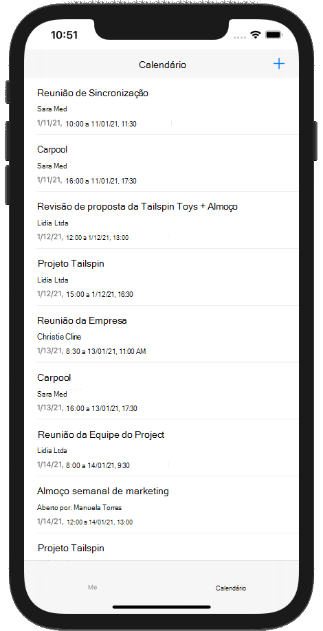

<!-- markdownlint-disable MD002 MD041 -->

Neste exercício, você incorporará o Microsoft Graph no aplicativo. Para este aplicativo, você usará o [SDK do Microsoft Graph para o objetivo C](https://github.com/microsoftgraph/msgraph-sdk-objc) para fazer chamadas para o Microsoft Graph.

## <a name="get-calendar-events-from-outlook"></a>Obter eventos de calendário do Outlook

Nesta seção, você estenderá a `GraphManager` classe para adicionar uma função para obter os eventos e a atualização `CalendarViewController` do usuário para usar essas novas funções.

1. Abra o **graphmanager. Swift** e adicione o método a seguir `GraphManager` à classe.

    ```Swift
    public func getEvents(completion: @escaping(Data?, Error?) -> Void) {
        // GET /me/events?$select='subject,organizer,start,end'$orderby=createdDateTime DESC
        // Only return these fields in results
        let select = "$select=subject,organizer,start,end"
        // Sort results by when they were created, newest first
        let orderBy = "$orderby=createdDateTime+DESC"
        let eventsRequest = NSMutableURLRequest(url: URL(string: "\(MSGraphBaseURL)/me/events?\(select)&\(orderBy)")!)
        let eventsDataTask = MSURLSessionDataTask(request: eventsRequest, client: self.client, completion: {
            (data: Data?, response: URLResponse?, graphError: Error?) in
            guard let eventsData = data, graphError == nil else {
                completion(nil, graphError)
                return
            }

            // TEMPORARY
            completion(eventsData, nil)
        })

        // Execute the request
        eventsDataTask?.execute()
    }
    ```

    > [!NOTE]
    > Considere o que o código `getEvents` está fazendo.
    >
    > - A URL que será chamada é `/v1.0/me/events`.
    > - O `select` parâmetro de consulta limita os campos retornados para cada evento para apenas aqueles que o aplicativo usará realmente.
    > - O `orderby` parâmetro de consulta classifica os resultados pela data e hora em que foram criados, com o item mais recente em primeiro lugar.

1. Abra **CalendarViewController. Swift** e substitua todo o conteúdo pelo código a seguir.

    ```Swift
    import UIKit
    import MSGraphClientModels

    class CalendarViewController: UIViewController {

        @IBOutlet var calendarJSON: UITextView!

        private let spinner = SpinnerViewController()

        override func viewDidLoad() {
            super.viewDidLoad()

            // Do any additional setup after loading the view.
            self.spinner.start(container: self)

            GraphManager.instance.getEvents {
                (data: Data?, error: Error?) in
                DispatchQueue.main.async {
                    self.spinner.stop()

                    guard let eventsData = data, error == nil else {
                        self.calendarJSON.text = error.debugDescription
                        return
                    }

                    let jsonString = String(data: eventsData, encoding: .utf8)
                    self.calendarJSON.text = jsonString
                    self.calendarJSON.sizeToFit()
                }
            }
        }
    }
    ```

Agora você pode executar o aplicativo, entrar e tocar no item de navegação de **calendário** no menu. Você deve ver um despejo JSON dos eventos no aplicativo.

## <a name="display-the-results"></a>Exibir os resultados

Agora você pode substituir o despejo JSON por algo para exibir os resultados de forma amigável. Nesta seção, você irá modificar a `getEvents` função para retornar objetos fortemente tipados e modificar `CalendarViewController` para usar um modo de exibição de tabela para renderizar os eventos.

1. Abra o **graphmanager. Swift**. Substitua a função `getEvents` existente pelo seguinte.

    :::code language="swift" source="../demo/GraphTutorial/GraphTutorial/GraphManager.swift" id="GetEventsSnippet" highlight="1,17-38":::

1. Crie um novo arquivo de **classe Touch** do Cocoa **GraphTutorial** no projeto GraphTutorial `CalendarTableViewCell.swift`chamado. Escolha **UITableViewCell** na **subclasse de** Field.

1. Abra **CalendarTableViewCell. Swift** e adicione o código a seguir à `CalendarTableViewCell` classe.

    :::code language="swift" source="../demo/GraphTutorial/GraphTutorial/CalendarTableViewCell.swift" id="PropertiesSnippet":::

1. Abra **Main. Storyboard** e localize a **cena do calendário**. Selecione o **modo de exibição** na **cena do calendário** e exclua-o.

    

1. Adicione um **modo de exibição de tabela** da **biblioteca** à **cena do calendário**.
1. Selecione o modo de exibição de tabela e, em seguida, selecione o **Inspetor de atributos**. Definir **células de protótipo** como **1**.
1. Use a **biblioteca** para adicionar três **Rótulos** à célula prototype.
1. Selecione a célula Prototype e, em seguida, selecione o **Inspetor de identidade**. Altere a **classe** para **CalendarTableViewCell**.
1. Selecione o **Inspetor de atributos** e defina o `EventCell` **identificador** como.
1. Com o **EventCell** selecionado, selecione o **Inspetor de conexões** e `durationLabel`Conecte `organizerLabel`-se `subjectLabel` , e para os rótulos que você adicionou à célula no storyboard.
1. Defina as propriedades e as restrições nos três rótulos da seguinte maneira.

    - **Rótulo de assunto**
        - Adicionar restrição: espaço à esquerda na margem esquerda da exibição de conteúdo, valor: 0
        - Adicionar restrição: espaço à direita à margem à direita da exibição do conteúdo, valor: 0
        - Adicionar restrição: espaço superior à margem superior do modo de exibição de conteúdo, valor: 0
    - **Rótulo do organizador**
        - Fonte: System 12,0
        - Adicionar restrição: espaço à esquerda na margem esquerda da exibição de conteúdo, valor: 0
        - Adicionar restrição: espaço à direita à margem à direita da exibição do conteúdo, valor: 0
        - Adicionar restrição: espaço superior para rótulo de assunto inferior, valor: padrão
    - **Rótulo de duração**
        - Fonte: System 12,0
        - Cor: cor cinza escuro
        - Adicionar restrição: espaço à esquerda na margem esquerda da exibição de conteúdo, valor: 0
        - Adicionar restrição: espaço à direita à margem à direita da exibição do conteúdo, valor: 0
        - Adicionar restrição: espaço superior ao rótulo do organizador inferior, valor: padrão
        - Adicionar restrição: espaço inferior à margem inferior da visualização de conteúdo, valor: 8

    

1. Abra **CalendarViewController. Swift** e substitua seu conteúdo pelo código a seguir.

    :::code language="swift" source="../demo/GraphTutorial/GraphTutorial/CalendarViewController.swift" id="CalendarViewSnippet":::

1. Execute o aplicativo, entre e toque na guia **calendário** . Você deve ver a lista de eventos.

    
