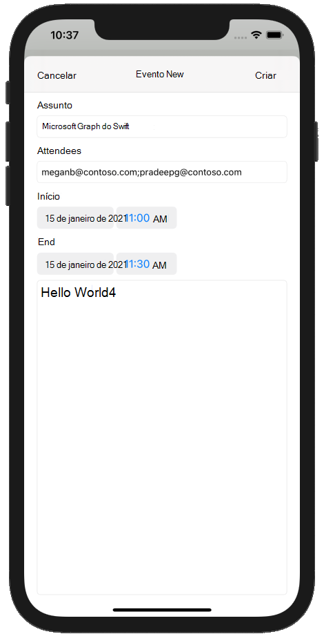

<!-- markdownlint-disable MD002 MD041 -->

Nesta seção, você adicionará a capacidade de criar eventos no calendário do usuário.In this section you will add the ability to create events on the user's calendar.

1. Abra **GraphManager.swift** e adicione a função a seguir para criar um novo evento no calendário do usuário.Open **GraphManager.swift** and add the following function to create a new event on the user's calendar.

    :::code language="swift" source="../demo/GraphTutorial/GraphTutorial/GraphManager.swift" id="CreateEventSnippet":::

1. Crie um novo **arquivo de classe Cocoa Touch** na pasta **GraphTutorial** chamada `NewEventViewController` .Create a new **Cocoa Touch Class** file in the **GraphTutorial** folder named `NewEventViewController`. Escolha **UIViewController** na **Subclasse do** campo.Choose **UIViewController** in the **Subclass of** field.
1. Abra **NewEventViewController.swift** e substitua seu conteúdo pelo seguinte.Open **NewEventViewController.swift** and replace its contents with the following.

    :::code language="swift" source="../demo/GraphTutorial/GraphTutorial/NewEventViewController.swift" id="NewEventViewControllerSnippet":::

1. Abra **Main.storyboard**.Open **Main.storyboard**. Use a **Biblioteca para** arrastar um Controlador **de Exibição** para o storyboard.Use the **Library** to drag a **View Controller** onto the storyboard.
1. Usando a **Biblioteca,** adicione uma **Barra de Navegação** ao controlador de exibição.Using the **Library**, add a **Navigation Bar** to the view controller.
1. Clique duas vezes no **título** na barra de navegação e atualize-o para `New Event` .Double-click the **Title** in the navigation bar and update it to `New Event`.
1. Usando a **biblioteca**, adicione um **item de** botão de barra ao lado esquerdo da barra de navegação.Using the **Library**, add a **Bar Button Item** to the left-hand side of the navigation bar.
1. Selecione o novo botão de barra e selecione o **Inspetor de Atributos.**Select the new bar button, then select the **Attributes Inspector**. Altere **o título** para `Cancel` .Change **Title** to `Cancel`.
1. Usando a **biblioteca**, adicione um **item de** botão de barra ao lado direito da barra de navegação.Using the **Library**, add a **Bar Button Item** to the right-hand side of the navigation bar.
1. Selecione o novo botão de barra e selecione o **Inspetor de Atributos.**Select the new bar button, then select the **Attributes Inspector**. Altere **o título** para `Create` .Change **Title** to `Create`.
1. Selecione o controlador de exibição e, em seguida, selecione o **Inspetor de Identidade.**Select the view controller, then select the **Identity Inspector**. Altere **a** classe **para NewEventViewController**.Change **Class** to **NewEventViewController**.
1. Adicione os seguintes controles da **Biblioteca** à exibição.Add the following controls from the **Library** to the view.

    - Adicione um **Rótulo** na barra de navegação.Add a **Label** under the navigation bar. Definir seu texto como `Subject` .Set its text to `Subject`.
    - Adicione um **campo de** texto sob o rótulo.Add a **Text Field** under the label. De definir **seu atributo placeholder** como `Subject` .Set its **Placeholder** attribute to `Subject`.
    - Adicione um **Rótulo** sob o campo de texto.Add a **Label** under the text field. Definir seu texto como `Attendees` .Set its text to `Attendees`.
    - Adicione um **campo de** texto sob o rótulo.Add a **Text Field** under the label. De definir **seu atributo placeholder** como `Separate multiple entries with ;` .Set its **Placeholder** attribute to `Separate multiple entries with ;`.
    - Adicione um **Rótulo** sob o campo de texto.Add a **Label** under the text field. Definir seu texto como `Start` .Set its text to `Start`.
    - Adicione um **Selador de Data** sob o rótulo.Add a **Date Picker** under the label. Definir seu **estilo preferencial** para **compactar**, **seu intervalo** como **15 minutos** e sua altura como **35**.Set its **Preferred Style** to **Compact**, its **Interval** to **15 minutes**, and its height to **35**.
    - Adicione um **Rótulo** no selador de data.Add a **Label** under the date picker. Definir seu texto como `End` .Set its text to `End`.
    - Adicione um **Selador de Data** sob o rótulo.Add a **Date Picker** under the label. Definir seu **estilo preferencial** para **compactar**, **seu intervalo** como **15 minutos** e sua altura como **35**.Set its **Preferred Style** to **Compact**, its **Interval** to **15 minutes**, and its height to **35**.
    - Adicione um **ponto de exibição de** texto no selador de data.Add a **Text View** under the date picker.

1. Selecione o **Novo Controlador de Exibição de Evento** e use o Inspetor de **Conexão** para fazer as seguintes conexões.Select the **New Event View Controller** and use the **Connection Inspector** to make the following connections.

    - Conecte a **ação de** cancelamento recebida ao **botão Cancelar** barra.Connect the **cancel** received action to the **Cancel** bar button.
    - Conecte a **ação createEvent** recebida ao **botão Criar** barra.Connect the **createEvent** received action to the **Create** bar button.
    - Conecte a **saída do** assunto ao primeiro campo de texto.Connect the **subject** outlet to the first text field.
    - Conecte a **saída dos participantes** ao segundo campo de texto.Connect the **attendees** outlet to the second text field.
    - Conecte a **saída** de início ao primeiro se picker de data.Connect the **start** outlet to the first date picker.
    - Conecte a **saída final** ao segundo se picker de data.Connect the **end** outlet to the second date picker.
    - Conecte a **saída do** corpo ao exibição de texto.Connect the **body** outlet to the text view.

1. Adicione as restrições a seguir.Add the following constraints.

    - **Barra de Navegação****Navigation Bar**
        - Espaço à frente para a Área de Segurança, valor: 0Leading space to Safe Area, value: 0
        - Espaço à trailing para Área de Segurança, valor: 0Trailing space to Safe Area, value: 0
        - Espaço superior para Área de Segurança, valor: 0Top space to Safe Area, value: 0
        - Altura, valor: 44Height, value: 44
    - **Rótulo de Assunto****Subject Label**
        - Espaço à esquerda para a margem exibir, valor: 0Leading space to View margin, value: 0
        - Espaço à direita para Exibir margem, valor: 0Trailing space to View margin, value: 0
        - Espaço superior para a Barra de Navegação, valor: 20Top space to Navigation Bar, value: 20
    - **Campo Texto do Assunto****Subject Text Field**
        - Espaço à esquerda para a margem exibir, valor: 0Leading space to View margin, value: 0
        - Espaço à direita para Exibir margem, valor: 0Trailing space to View margin, value: 0
        - Espaço superior para o Rótulo de Assunto, valor: PadrãoTop space to Subject Label, value: Standard
    - **Rótulo dos participantes****Attendees Label**
        - Espaço à esquerda para a margem exibir, valor: 0Leading space to View margin, value: 0
        - Espaço à direita para Exibir margem, valor: 0Trailing space to View margin, value: 0
        - Espaço superior para o Campo de Texto do Assunto, valor: PadrãoTop space to Subject Text Field, value: Standard
    - **Campo de texto Participantes****Attendees Text Field**
        - Espaço à esquerda para a margem exibir, valor: 0Leading space to View margin, value: 0
        - Espaço à direita para Exibir margem, valor: 0Trailing space to View margin, value: 0
        - Espaço superior para o Rótulo de Participantes, valor: PadrãoTop space to Attendees Label, value: Standard
    - **Rótulo iniciar****Start Label**
        - Espaço à esquerda para a margem exibir, valor: 0Leading space to View margin, value: 0
        - Espaço à direita para Exibir margem, valor: 0Trailing space to View margin, value: 0
        - Espaço superior para o Campo de Texto do Assunto, valor: PadrãoTop space to Subject Text Field, value: Standard
    - **Start Date Picker****Start Date Picker**
        - Espaço à esquerda para a margem exibir, valor: 0Leading space to View margin, value: 0
        - Espaço à direita para Exibir margem, valor: 0Trailing space to View margin, value: 0
        - Espaço superior para o Rótulo de Participantes, valor: PadrãoTop space to Attendees Label, value: Standard
        - Altura, valor: 35Height, value: 35
    - **Rótulo final****End Label**
        - Espaço à esquerda para a margem exibir, valor: 0Leading space to View margin, value: 0
        - Espaço à direita para Exibir margem, valor: 0Trailing space to View margin, value: 0
        - Espaço superior para o Se picker de data de início, valor: PadrãoTop space to Start Date Picker, value: Standard
    - **End Date Picker****End Date Picker**
        - Espaço à esquerda para a margem exibir, valor: 0Leading space to View margin, value: 0
        - Espaço à direita para Exibir margem, valor: 0Trailing space to View margin, value: 0
        - Espaço superior para Rótulo Final, valor: PadrãoTop space to End Label, value: Standard
        - Altura: 35Height: 35
    - **Exibição de Corpo de Texto****Body Text View**
        - Espaço à esquerda para a margem exibir, valor: 0Leading space to View margin, value: 0
        - Espaço à direita para Exibir margem, valor: 0Trailing space to View margin, value: 0
        - Espaço superior para o Selador de Data de Término, valor: PadrãoTop space to End Date Picker, value: Standard
        - Espaço inferior para Exibir margem, valor: 0Bottom space to View margin, value: 0

    

1. Selecione a **Cena do Calendário** e selecione o Inspetor de **Conexões.**Select the **Calendar Scene**, then select the **Connections Inspector**.
1. Em **Segues Disparados,** arraste o círculo não preenchido ao lado de **manual** para o Novo Controlador de Modo de Exibição **de** Eventos no storyboard.Under **Triggered Segues**, drag the unfilled circle next to **manual** onto the **New Event View Controller** on the storyboard. Selecione **Apresentar Modalmente** no menu pop-up.Select **Present Modally** in the pop-up menu.
1. Selecione o segue que você acabou de adicionar e selecione o **Inspetor de Atributos.**Select the segue you just added, then select the **Attributes Inspector**. De definir **o campo Identificador** como `showEventForm` .Set the **Identifier** field to `showEventForm`.
1. Conecte a **ação showNewEventForm** recebida ao botão **+** da barra de navegação.Connect the **showNewEventForm** received action to the **+** navigation bar button.
1. Salve suas alterações e reinicie o aplicativo.Save your changes and restart the app. Vá para a página de calendário e toque no **+** botão.Go to the calendar page and tap the **+** button. Preencha o formulário e toque em **Criar** para criar um novo evento.Fill in the form and tap **Create** to create a new event.

    
